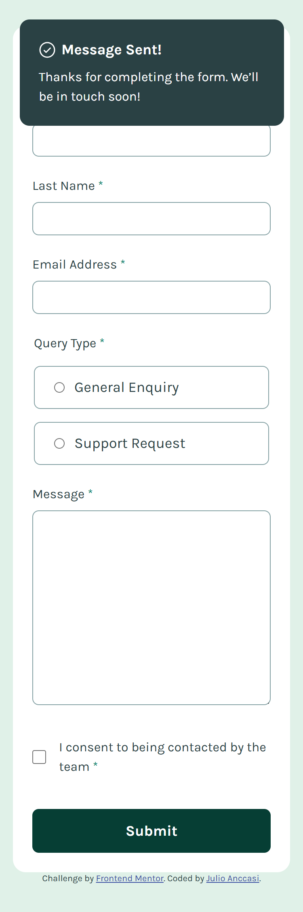
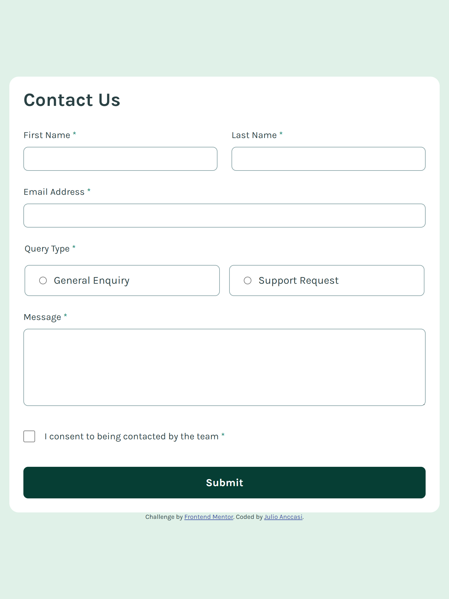
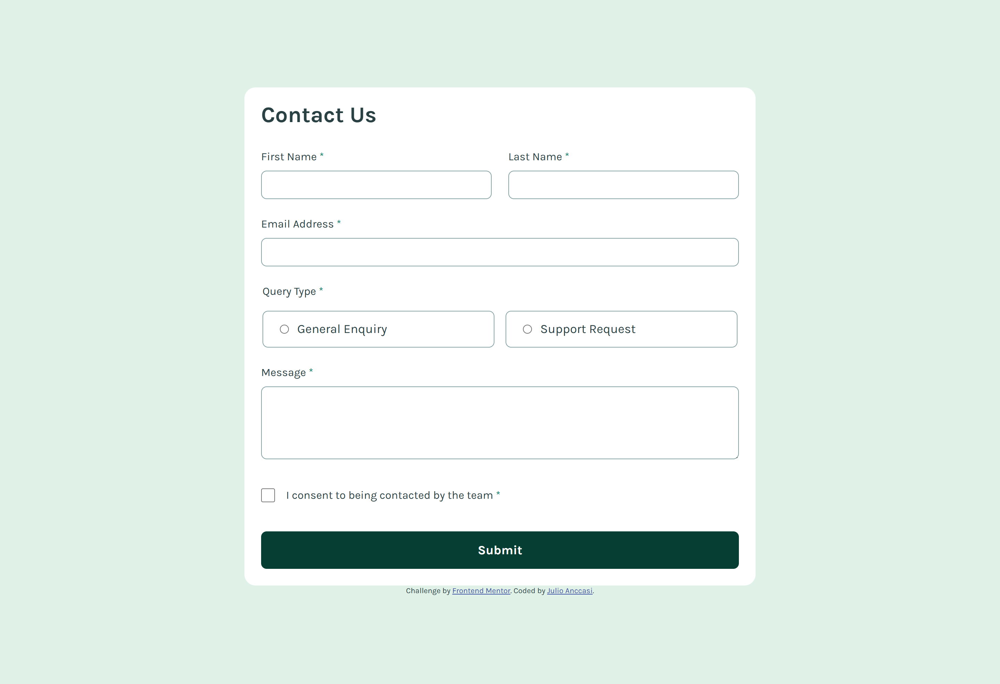

# Frontend Mentor - Contact form solution

This is a solution to the [Contact form challenge on Frontend Mentor](https://www.frontendmentor.io/challenges/contact-form--G-hYlqKJj). Frontend Mentor challenges help you improve your coding skills by building realistic projects.

## Table of contents

- [Frontend Mentor - Contact form solution](#frontend-mentor---contact-form-solution)
  - [Table of contents](#table-of-contents)
  - [Overview](#overview)
    - [The challenge](#the-challenge)
    - [Screenshot](#screenshot)
    - [Links](#links)
  - [My process](#my-process)
    - [Built with](#built-with)
    - [What I learned](#what-i-learned)
    - [Continued development](#continued-development)
  - [Author](#author)

## Overview

### The challenge

Users should be able to:

- Complete the form and see a success toast message upon successful submission
- Receive form validation messages if:
  - A required field has been missed
  - The email address is not formatted correctly
- Complete the form only using their keyboard
- Have inputs, error messages, and the success message announced on their screen reader
- View the optimal layout for the interface depending on their device's screen size
- See hover and focus states for all interactive elements on the page

### Screenshot





### Links

- Solution URL: [https://github.com/ChechiX/contact-form](https://github.com/ChechiX/contact-form)
- Live Site URL: [https://chechix.github.io/contact-form/](https://chechix.github.io/contact-form/)

## My process

### Built with

- Semantic HTML5 markup
- CSS custom properties
- Flexbox
- CSS Grid
- Mobile-first workflow

### What I learned

This was a great project to practice building accessible forms. I learned how to use ARIA attributes to improve the accessibility of form inputs and error messages. For example, I used `aria-invalid` to indicate when an input has an error and `aria-describedby` to associate error messages with their corresponding inputs.

```html
<input
  class="card__field-input"
  type="text"
  id="lastName"
  name="lastName"
  required
  autocomplete="family-name"
  aria-invalid="false"
  aria-describedby="lastNameError"
/>
```

### Continued development

If I were to continue developing this project, I would add more robust form validation and error handling. For example, I could implement real-time validation that provides feedback to the user as they fill out the form, rather than only validating on submission. I would also consider adding a CAPTCHA to prevent spam submissions.

## Author

- Frontend Mentor - [@ChechiX](https://www.frontendmentor.io/profile/ChechiX)
